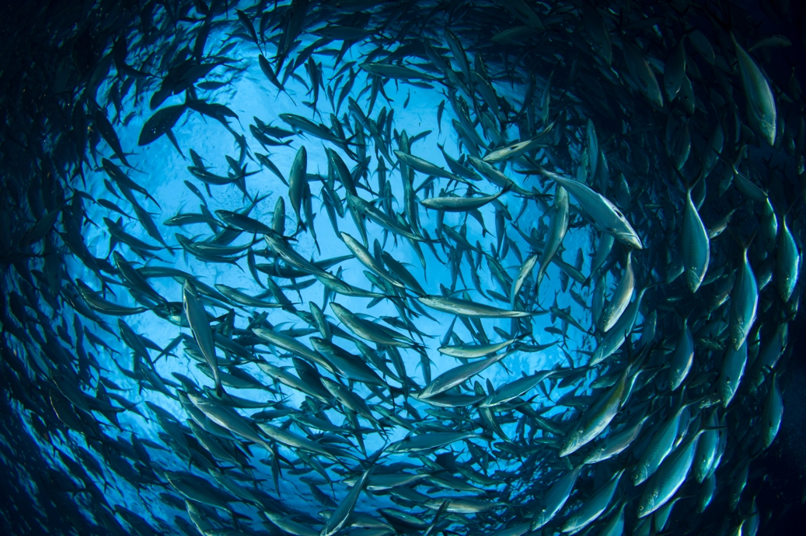

```{r setup, include=FALSE}
knitr::opts_chunk$set(echo = FALSE)
```

I. Title: Overfishing

II. Name of magazine

http://www.ethicalcorp.com/over-fishing-worse-threat-oceans-climate-change 

III. Vocabulary 

| Words from the text | Synonym / explanation in English |
|----------------------------|----------------------------------|
| Mitigating climate  | Abate climat |
| Wider environmental impact | Broad |
| Criticism | catchy |

IV. Analysis table

|   |   |
|------------------------------|------------------------------------------------------------------------------------------------------------------------------------------------------------------------------------------------------------------------------------------------------------------------------------------------------------------------------------------------------------------------------------|
| Researchers | Angeli Mehta is a former BBC current affairs producer, with a research PhD |
| Published in? | 22Th of January 2019 |
| General topic? | Over-fishing a worse threat to oceans than climate change |
| Procedure/what was examined? | Angeli Mehta reports on how initiatives like Global Fishing Watch, Sky’s Ocean Rescue and the retailer-led Seafood Task Force are trying to tackle a practice that is doing untold damage to the marine ecosystem |
| Conclusions/discovery? | At the G7 meeting of environment, energy and oceans ministers in Halifax last September, Canada announced it would invest up to C$11.6m to combat illegal, unreported and unregulated fishing throughout the world and declared support for Global Fishing Watch, committing to publicly sharing information about the health of Canada’s fish stocks and its fisheries management |
| Remaining questions? | See Are sustainability certification schemes fit for purpose? |


